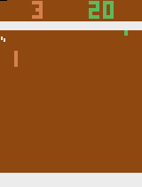
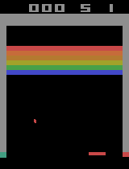
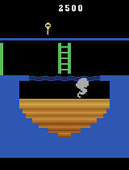
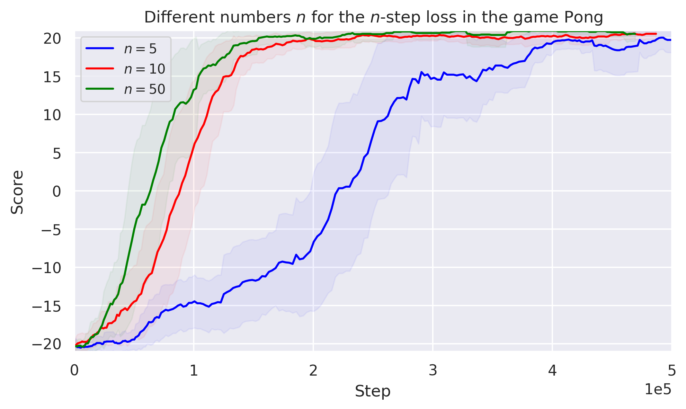
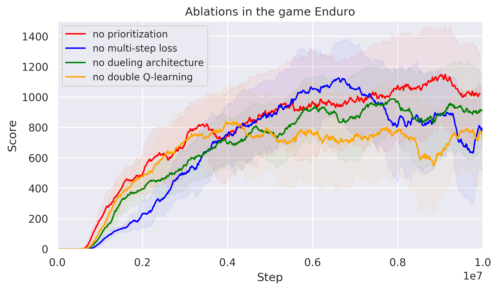
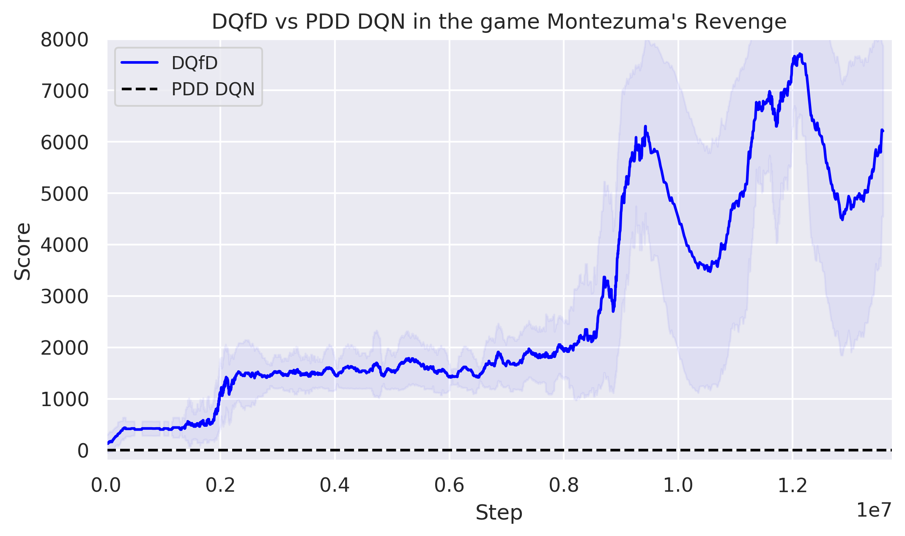

# Deep Q-Learning from Demonstrations (DQfD)
This repository contains an implementation of the learning algorithm proposed in [*Deep Q-Learning from Demonstrations* (Hester et al. 2018)](https://arxiv.org/pdf/1704.03732.pdf) for solving *Atari 2600* video games using a combination of reinforcement learning and imitation learning techniques.

Note: The implementation is part of my Bachelor's Thesis [*Tiefes Q-Lernen mit Demonstrationen*](https://ins.uni-bonn.de/media/public/publication-media/BA_Skript_Felix_Kerkhoff.pdf).


|  |  |  |
| :---: | :---: | :---: |
|  |  | |

<!--| :---: | :---: | -->


## Table of Contents
* [Features](#features)
* [Getting Started](#gettingstarted)
    * [Installation](#installation)
    * [Usage](#usage)
* [Some Experiments](#experiments)
    * [Different numbers n for the n-step loss in the game *Pong*](#pongexp)
    * [Ablations in the game *Enduro*](#enduroexp)
    * [Using demonstrations to learn *Montezuma's Revenge*](#montezumaexp)
* [Task List](#todo)
* [License](#license)

## Features <a name="features"></a>
* DQN (cf. [*Human-level control through deep reinforcement learning* (Mnih et al. 2015)](http://klab.tch.harvard.edu/academia/classes/BAI/pdfs/MnihEtAlHassibis15NatureControlDeepRL.pdf))
* Double DQN (cf. [*Deep Reinforcement Learning with Double Q-learning* (Van Hasselt, Guez, Silver 2015)](https://arxiv.org/pdf/1509.06461.pdf))
* PER (cf. [*Prioritized Experience Replay* (Schaul et al. 2015)](https://arxiv.org/pdf/1511.05952.pdf))
* Dueling DQN (cf. [*Dueling Network Architectures for Deep Reinforcement Learning* (Wang et al. 2016)](http://proceedings.mlr.press/v48/wangf16.pdf))
* n-step DQN (cf. [*Understanding Multi-Step Deep Reinforcement Learning: A Systematic Study of the DQN Target* (Hernandez-Garcia, Sutton 2019)](https://arxiv.org/pdf/1901.07510.pdf))
* DQfD (cf. [*Deep Q-Learning from Demonstrations* (Hester et al. 2018)](https://arxiv.org/pdf/1704.03732.pdf))

## Getting Started <a name="gettingstarted"></a>

<!-- ### Dependencies <a name="dependencies"></a>
| Package | Version |
| :--- | :---: |
| Python | 3.7 |
| Tensorflow | 2.1.0 |
| Gym | 0.15.4|
| Numpy | 1.17.4 |
| OpenCV | 4.1.2.30 |
| Pandas | 0.25.3 |
| Cython | 0.29.14 |
-->

### Installation <a name="installation"></a>
#### 1. Clone the repository
In order to clone the repository, open your terminal, move to the directory in which you want to store the project and type
```console
$ git clone https://github.com/felix-kerkhoff/DQfD.git
```

#### 2. Create a virtual environment
The installation of the GPU-Version of TensorFlow with the proper Nvidia driver and Cuda libraries from source can be quite tricky.
I recommend using [Anaconda](https://docs.anaconda.com/anaconda/install/)/[Miniconda](https://docs.conda.io/en/latest/miniconda.html) to create a virtual environment for the installation of the necessary packages, as `conda` will automatically install the right Cuda libraries.
So type
```console
$ conda create --name atari_env
```
to create an environment called `atari_env`. 
If you already have a working TensorFlow 2 installation, you can of course also use `venv` and `pip` to create the virtual environment and install the packages.

#### 3. Install the required packages 
To install the packages, we first have to activate the environment by typing:
```console
$ conda activate atari_env
```
Then install the necessary packages specified in [requirements.txt](requirements.txt) by using the following command in the directory of your project:
```console
$ conda install --file requirements.txt -c conda-forge -c powerai
```

**Note**: 
* If you want to use `pip` for the installation, you will need to make the following changes to the [requirements.txt](requirements.txt) file:
    * replace the line `atari_py==0.2.6` by `atari-py==0.2.6`
    * replace the line `opencv==4.4.0` by `opencv-python==4.4.0`


* For being able to compile the Cython modules, make sure to have a proper C/C++ compiler installed. See the [Cython Documentation](https://cython.readthedocs.io/en/latest/src/quickstart/install.html) for further information.


### Usage <a name="usage"></a>
To see if everything works fine, I recommend training your first agent on the game *Pong* as this game needs the least training time.
Therefor just run the following command in your terminal (in the directory of your project):
```console
$ python pong_standard_experiment.py
```
You should be seeing good results after about 150,000 training steps which corresponds to about 15 minutes of computation time on my machine.
By using `n_step = 50` instead of `n_step = 10` as the number of steps considered for the n-step loss, you can even speed up the process to get good results after less than 100,000 training steps or 10 minutes (see the [experiment](#pongexp) in the next section).
Feel free to experiment with all the other parameters and games by changing them in the respective file.

## Some Experiments <a name="experiments"></a>
### Different numbers n for the n-step loss in the game *Pong* <a name="pongexp"></a>
With the first experiment, we try to show how the use of multi-step losses can speed up the training process in the game *Pong*.



### Ablations in the game *Enduro* <a name="enduroexp"></a>
In the next experiment we investigate the influence of the different components of *n-step Prioritized Dueling Double Deep Q-Learning* using the example of the game *Enduro*. We will do this by leaving out exactly one of the components and keeping all other parameters unchanged.



### Using demonstrations to learn *Montezuma's Revenge* <a name="montezumaexp"></a>
Due to very sparse rewards and the need of long-term planning, *Montezuma's Revenge* is known to be one of the most difficult *Atari 2600* games to solve for deep reinforcement learning agents, such that most of them fail in this game. The use of human demonstrations might help to overcome this issue:



**Note**: 
* The figures show the number of steps (i.e. the number of decisions made by the agent) on the x-axis and the scores achieved during the training process on the y-axis. The learning curves are smoothed using the moving average over intervals of 50 episodes and the shaded areas correspond to the standard deviance within these intervals.
* The learning curves were produced using the parameters (except of the ones that were considered in the experiments such as `n_step` in the first experiment) specified in the files [pong_standard_experiment.py](pong_standard_experiment.py), [enduro_standard_experiment.py](enduro_standard_experiment.py) and [montezuma_demo_experiment.py](montezuma_demo_experiment.py).

## Task List <a name="todo"></a>
* [x] binary sum tree for fast proportional sampling
* [x] Cython implementation of PER for memory efficient and fast storage and sampling of experiences
* [x] DQN implementation (in TensorFlow 2 syntax) with an optional dueling network architecture and the possibility to use a combination of the following losses:
    * single-step Q-Learning loss
    * multi-step Q-Learning loss
    * large margin classification loss (cf. [*Boosted Bellman Residual Minimization Handling Expert Demonstrations* (Piot, Geist, Pietquin 2014)](http://www.lifl.fr/~pietquin/pdf/ECML_2014_OPMGBP.pdf))
    * L2-regularization loss
* [x] Q-learning agent including the learning algorithm
* [x] logger for the documentation of the learning process
* [x] environment preprocessing
* [x] loading and preprocesing of human demonstration data using the Atari-HEAD data set (cf. [*Atari-HEAD: Atari Human Eye-Tracking and Demonstration Dataset* (Zhang et al. 2019)](https://arxiv.org/pdf/1903.06754.pdf)) as resource
* [ ] function to use a pretrained model as demonstrator
* [ ] agent wrapper
* [ ] more advanced exploration strategies
* [ ] argparse function for command-line parameter selection
* [ ] random seed control for better reproducibility
* [ ] agent evaluation as suggested in [*The Arcade Learning Environment: An Evaluation Platform for General Agents* (Bellemare et al. 2013)](https://arxiv.org/pdf/1207.4708.pdf) for better comparability

## License <a name="license"></a>
This project is licensed under the terms of the [MIT license](LICENSE.md).

Copyright (c) 2020 Felix Kerkhoff

